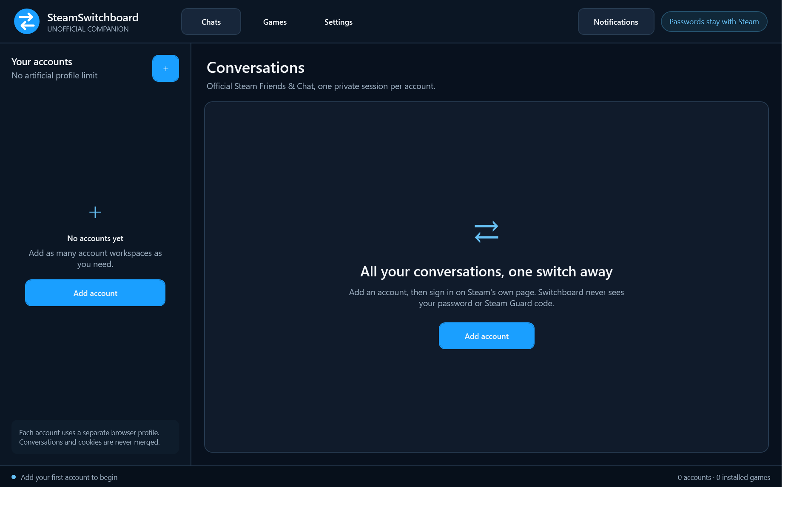

# SteamSwitchboard

<p align="center">
  
</p>

SteamSwitchboard is a privacy-first Windows companion for people who use several Steam accounts. It gives every saved profile an independent official Steam web-chat session and provides an account-verified launcher for installed games.



> **Initial release:** version 1.0.0 is the first public source release. The included Windows build is unsigned; its checksum detects accidental corruption but does not authenticate the publisher. Sign the first-party binaries and distribute them through an authenticated installer/package before wider public distribution.

## What it solves

- **Conversations without account churn.** Every Switchboard profile receives a separate Microsoft Edge WebView2 profile, so its Steam web session, cookies, and cache remain isolated from the others. Up to 16 chats stay open concurrently by default; additional saved profiles reopen on selection without losing their persisted Steam sign-in. A memory-saving sleep option remains available in Settings.
- **Account-aware notifications.** Steam web notifications are surfaced with the receiving Switchboard profile, immutable login name, and Steam-provided notification title (normally the sender shown by Steam). Tagged replacements, native click/close lifecycle, a correlated unread fallback, raw-input bounds, and per-profile/global flood circuit breakers prevent duplicates and unbounded work. Message previews are off by default, Windows alerts have a master switch, notification text is never persisted, and the in-app history is bounded to the current run. A Windows alert click opens the labelled notification center because the legacy balloon API does not identify which alert was clicked; choosing a specific entry there opens the correct account.
- **Safer account-aware launching.** Switchboard discovers installed Steam libraries and labels every action `Play as <account>`. Before launching, it repeatedly verifies a local Valve-signed `steam.exe`, one stable Steam process identity, and one authoritative active SteamID—including a final check after locking the executable. If anything is unknown, duplicated, or changes, launch stays blocked.
- **Capacity beyond Steam's small account cache.** Switchboard supports up to 512 saved profiles on one PC. A safety budget keeps at most 16 WebView2 chats live simultaneously; the least-recently-used hidden workspace closes and transparently reopens when a seventeenth profile is selected. These explicit bounds prevent a damaged state file from exhausting the machine.
- **Beginner-friendly operation.** Steam and installed games are discovered automatically. Friendly profile labels can be renamed at any time, the play account has its own clear drop-down, and account removal includes a plain-language confirmation and local-session cleanup.

## Quick start

1. Extract the downloaded `SteamSwitchboard-1.0.0-win-x64.zip`.
2. Run `SteamSwitchboard.exe`.
3. Choose **Add account**, enter a friendly label and the account's Steam login name, then sign in on the official Steam page shown inside the app.
4. Select any account to use its conversation workspace. Up to 16 open profiles can notify you in the background; additional saved profiles reopen when selected.
5. Open **Games**, choose the intended account from **Play account**, and select **Play as…** beside a game. If Steam is using another account, Switchboard opens Steam, waits for you to use Steam's own account switcher, verifies the exact active account, and starts the game automatically.

To change a friendly label later, select the account and use **Settings → Rename profile**. The Steam login name used for launch verification is intentionally not changed by renaming the label.

Steam Guard and QR approval continue to work through Steam's own sign-in page. SteamSwitchboard never asks for or stores a password.

The Switchboard label is a convenience label, not proof of the web identity. A permanent banner shows the expected login name; always confirm the account displayed by Steam's page before sending a message.

## The important Steam limitation

Valve supports using several accounts on one computer, but the native Steam desktop client permits only one active account at a time. SteamSwitchboard therefore does **not** claim to run several native Steam client sessions or several account-bound games simultaneously on one Windows desktop. It does not inject into Steam, copy authentication tokens, automate password entry, modify `loginusers.vdf`, bypass anti-cheat, or emulate the Steam protocol.

The safe product boundary is:

- up to 16 simultaneous, isolated Steam **web conversation sessions**, with as many as 512 saved profiles; and
- one native Steam **play account** at a time, with explicit verification and a guided account switch when needed.

This follows [Valve's published account-use rule](https://help.steampowered.com/en/faqs/view/71EA-CDCE-FB5C-82B3). Running games under truly concurrent accounts requires separate operating-system or physical/remote machine environments and is outside this project.

## Requirements

- 64-bit Windows 10 or Windows 11
- Steam desktop client for game launching
- Internet access for Steam web chat
- Microsoft Edge WebView2 Evergreen Runtime; it is present on most current Windows installations and can be obtained from [Microsoft's WebView2 download page](https://developer.microsoft.com/en-us/microsoft-edge/webview2/consumer/)

The packaged build includes the .NET runtime, so a separate .NET installation is not required for end users.

## Privacy and security

- Embedded documents are limited to the exact `steamcommunity.com/chat` and `steamcommunity.com/login` routes over default-port HTTPS. Child frames use the same policy.
- The app exposes no browser host objects or web messaging. Developer tools, script dialogs, context menus, password saving, autofill, downloads, camera, clipboard reads, screen capture, HTTP authentication, client certificates, and custom protocols are blocked. Exact-origin Steam notification permission is handled by the host, while a visible, user-initiated Steam microphone request may use WebView2's own prompt; neither decision is saved.
- Notification titles and bodies are treated as untrusted input, raw-size checked before sanitisation, stripped of control/bidirectional formatting characters, replacement-aware, globally and per-profile rate-contained, bounded in memory, and never written to state or diagnostics.
- User-initiated external HTTPS links show the complete canonical destination before opening in the system browser. Script-initiated external navigation is silently blocked.
- Profile names on disk are generated GUIDs rather than Steam login names.
- Steam metadata is read with strict path, size, nesting, and identity limits. Remote, linked, malformed, or overlarge metadata is ignored. The app never modifies Steam configuration.
- Choosing **Forget account** first saves a durable cleanup request, suppresses alerts, and commits the browser to a local blank document before clearing it. The local record is removed only after WebView2 accepts profile deletion; failed cleanup remains visible and retries next launch with no live workspace left behind.
- The application refuses elevation and a second concurrent instance.

Local data lives at `%LOCALAPPDATA%\SteamSwitchboard`. See [Privacy](docs/PRIVACY.md), [Security](SECURITY.md), and [Architecture](docs/ARCHITECTURE.md) for the complete boundary.

## Build and verify

Development requires the .NET 9 SDK on Windows.

```powershell
./scripts/verify.ps1
```

That command regenerates the icon, performs a signed-package/locked restore with NuGet auditing, verifies formatting, compiles Release with warnings and security diagnostics treated as errors, and runs the full test suite.

For the extended dependency, secret, configuration, and static-analysis pass:

```powershell
./scripts/security-audit.ps1 -RequireExternalScanners
```

To create the self-contained Windows package:

```powershell
./scripts/package.ps1
```

The ZIP and SHA-256 checksum are written to `artifacts/release/`. Packaging validates archive paths before extraction, runs adversarial validator fixtures, excludes debug/session data, and normalises ZIP order and timestamps. Pass `-RequireSignature` only in a release environment where first-party binaries have been Authenticode-signed.

## Project map

- `src/SteamSwitchboard.App` — WPF application, WebView2 chat profiles, Steam discovery, and guarded launch flow
- `tests/SteamSwitchboard.Tests` — parser, persistence, policy, discovery, navigation, and account-transition tests
- `docs/ARCHITECTURE.md` — component and trust-boundary design
- `docs/VALIDATION.md` — automated and live validation evidence
- `docs/GITHUB_RELEASE.md` — beginner GitHub push, Actions build, scan, artifact, and release steps
- `scripts/verify.ps1` — reproducible verification entry point
- `scripts/package.ps1` — self-contained Windows release packaging

## Contributing

See [CONTRIBUTING.md](CONTRIBUTING.md) for the required local checks and project security boundaries. GitHub pushes and pull requests run the same Windows Release verification gate automatically.

GitHub Actions uses pinned Semgrep and Trivy security jobs before the Windows Release build/test/package gate. See the [GitHub release guide](docs/GITHUB_RELEASE.md) for the exact first-push and v1.0.0 artifact steps.

SteamSwitchboard is unofficial and is not affiliated with or endorsed by Valve Corporation. Steam and the Steam logo are trademarks of Valve Corporation.
